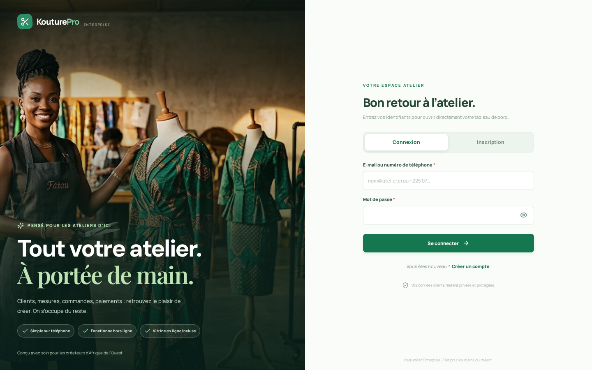

# KouturePro Enterprise

Application SaaS/PWA de gestion d'atelier de couture, en français et en FCFA, avec vitrine publique par atelier. **Production : [kouturepro.vercel.app](https://kouturepro.vercel.app)** sur Vercel Functions + PostgreSQL (Neon) + Vercel Blob. Le 23 septembre 2026, l'API et l'inscription ont été vérifiées en ligne ; la base Neon comporte 21 tables KouturePro et aucun atelier fictif. La base SQLite indépendante reste réservée au développement local ; elle n'est pas envoyée sur Vercel. **Avant de stocker de vraies données clients, prévoir une sauvegarde récupérable des clés de chiffrement hors Vercel** et consulter [le guide de déploiement Vercel](docs/deploiement-vercel.md).

## Aperçu



[Inscription mobile](docs/screenshots/inscription-mobile.png) · [Tableau de bord et rubriques](docs/screenshots/modules-navigation.png) · [Menu des rubriques sur Android](docs/screenshots/modules-navigation-mobile.png) · [Premiers pas après inscription](docs/screenshots/premiers-pas-mobile.png)

## Essayer en local

```bash
npm install
npm run dev
```

Ouvrir **http://localhost:3000/auth** : choisissez **Connexion** ou **Inscription** avec votre e-mail **ou** votre téléphone et un mot de passe. Une connexion validée ouvre directement **votre propre tableau de bord** ; « Créer un compte » mène à **une seule étape rapide** (nom et ville de l’atelier), puis ouvre le tableau de bord. L'application ne connecte plus automatiquement les visiteurs. Pour tester l’atelier « Atelier Koné » en développement, connectez-vous avec **`demo@kouturepro.test`** et **`Atelier2026!`** (ou la valeur de `DEMO_PASSWORD` si vous l’avez personnalisée). Le compte de démo ne peut pas se connecter en production. La vitrine publique reste accessible sur **http://localhost:3000/atelier-kone**.

### Générer une base de données fictive

```bash
npm run demo:db
DATA_DIR=demo-data npm run dev
```

La commande crée **`demo-data/kouturepro.sqlite`** avec un atelier, des clients, mensurations, commandes, paiements, tissus et membres fictifs. Elle refuse d’écraser un dossier qui contient déjà une base ou une clé ; dans ce projet, `demo-data/` a déjà été généré. Son fichier **`demo-data/local-secrets.json`** est indispensable pour relire les champs chiffrés : gardez les deux fichiers ensemble. La base existante dans `data/` n'est ni copiée ni modifiée. Cette base de démonstration est réservée au **développement**, et ces fichiers sont exclus de Git ; seul le script de génération est publié.

- `npm test` : tests d'API sur des bases SQLite temporaires ; avec `TEST_POSTGRES_URL` pointant **uniquement vers une base PostgreSQL jetable**, exécute en plus les tests PostgreSQL (redémarrage, persistance, chiffrement, isolation par atelier, verrouillage de connexion).
- `npm run test:auth` : parcours navigateur isolé Connexion / Inscription / hors ligne / changement de mot de passe (nécessite Chromium Playwright et `npm run build`).
- `npm run test:dashboard` : tableau de bord mobile/ordinateur sur une base jetable, chiffres issus des paiements confirmés, premières étapes du nouvel atelier et action adaptée au rôle comptable.
- `npm run test:modules` : les dix rubriques à 320, 390 et 1440 px, parcours interface → API → base SQLite isolée pour client, succursale, commande, acompte, production, stock et vitrine, ainsi que les permissions du couturier (nécessite Chromium Playwright et `npm run build`).
- `npm run build` : construit le site de production et le Worker PostgreSQL autonome requis par la Function Vercel.
- `SERVE_BUILD=1 npm run dev` : sert le build déjà créé avec la démo, sans lancer Vite (pratique sur un petit serveur de test).
- `npm start` : sert le build de production après configuration des secrets ci-dessous.
- `node tests/e2e.mjs` : parcours navigateur facultatif avec Playwright, **modifie les données de la démo** (installer Chromium et ses dépendances Playwright au préalable).

## Production Vercel, Neon et Blob

**État vérifié le 23 septembre 2026 :** la production est servie sur **[kouturepro.vercel.app](https://kouturepro.vercel.app)**. `/api/health` répond `database: ready`, `/auth` fonctionne, les visites sans session n'ouvrent pas le tableau de bord. La Function s'est connectée à la base directe Neon `neondb` et y a créé **21 tables** dans le schéma `kouturepro` ; un contrôle SQL séparé a confirmé **0 atelier** après la migration. Le store Blob public `kouturepro-medias` (région Paris) a passé un test réel d'écriture, lecture et suppression. La base fictive locale n'a **pas** été importée. [SQL d'initialisation reproductible](database/initialiser-neon.sql) et [guide Neon](database/README.md).

Le premier compte réel se crée sur `/auth`. **À terminer avant des données clients sensibles :** conserver une copie récupérable de `APP_ENCRYPTION_KEY` hors Vercel (la clé et `SESSION_SECRET` ont été générées pour mettre en service une base vide ; Vercel masque les valeurs après enregistrement), organiser des sauvegardes Neon/Blob, puis tester le parcours compte → client → commande → reconnexion sur la production. Ne jamais importer de base fictive sur Neon Production. Les moyens de paiement mobile nécessitent des accès marchands CinetPay actifs et une vérification réelle des opérateurs du contrat ; leur activation n'est pas confirmée par le simple déploiement.

Voir **[docs/deploiement-vercel.md](docs/deploiement-vercel.md)** pour la configuration, les contrôles et les limites de charge. Aucun service Render n'est nécessaire.

## Parcours déjà utilisables

La correspondance entre les dix rubriques de l'application, leurs routes et les tables Neon est détaillée dans [docs/modules-base-donnees.md](docs/modules-base-donnees.md).

- Connexion ou inscription par e-mail ou téléphone et mot de passe (hachage bcrypt). Après l’inscription, **une seule étape** demande le nom et la ville de l’atelier, puis ouvre le tableau de bord. WhatsApp est facultatif ; logo et spécialités se complètent ensuite dans Vitrine (gestion), avec le plan Starter au départ. Ancien écran de code SMS et entrée automatique dans la démo supprimés.
- Clients, coordonnées chiffrées, mesures chiffrées modifiables, notes vocales chiffrées, rapprochement simple de mesures.
- Commandes, tissu tiré du stock, patron réutilisable, cinq étapes de production, alertes, affectations et commissions par commande.
- Espèces/virement, acomptes, solde, caisse, dépenses, reçus/factures PDF (téléchargement, lien privé valable 7 jours partageable sur WhatsApp) et plans d'épargne individuels.
- Stock, seuils, achats et fournisseurs ; équipe, rôles et plusieurs boutiques. Le propriétaire crée un membre avec un identifiant et un mot de passe initial, à lui communiquer en privé. Chaque membre peut changer son mot de passe dans Paramètres.
- Tableau de bord mobile/ordinateur avec encaissements réels, reste à encaisser, commandes, priorités, cinq étapes de production, stock et rendez-vous. Un atelier neuf voit un démarrage guidé sans chiffres fictifs. Les indicateurs ouvrent directement leurs fiches, au tactile ou au clavier.
- Vitrine éditable et publique : galerie, avis, localisation, WhatsApp et demande de rendez-vous. Pages servies avec titre/meta, contenu HTML sans JavaScript, `LocalBusiness` + `Product` JSON-LD, sitemap et canonical.
- PWA installable ; après une première connexion en ligne sur l’appareil, saisies et notes vocales possibles hors ligne via IndexedDB, synchronisation automatique avec détection des conflits de version. Connexion et inscription nécessitent Internet. Le mode « Simuler le mode hors ligne » dans Paramètres permet de tester sans couper internet.

## Activer les services réels

Copier `.env.example` vers `.env` puis remplir les identifiants nécessaires. Le serveur charge automatiquement `.env`.

| Service | Variables | Comportement sans identifiants |
| --- | --- | --- |
| Rappels SMS | `TWILIO_ACCOUNT_SID`, `TWILIO_AUTH_TOKEN`, `TWILIO_FROM` | Les rappels SMS sont désactivés ; la connexion n’utilise pas de code SMS. |
| Mobile money | `CINETPAY_API_KEY`, `CINETPAY_SITE_ID`, `PUBLIC_BASE_URL` | L'encaissement mobile est **désactivé** : aucun faux paiement n'est créé. |
| WhatsApp intégré | `WHATSAPP_ACCESS_TOKEN`, `WHATSAPP_PHONE_ID`, `WHATSAPP_TEMPLATE_NAME` | Le bouton ouvre WhatsApp avec un message prérempli, sans prétendre l'envoyer automatiquement. |

Depuis une commande, « Partager la facture » crée un lien PDF privé signé, consultable sans compte pendant 7 jours. Vous pouvez le copier ou ouvrir WhatsApp avec le lien prérempli ; **ce dernier geste ne l’envoie pas automatiquement**. Si WhatsApp Cloud API est configuré, l’envoi direct du PDF est aussi proposé, sous réserve d’une conversation client active (fenêtre Meta de 24 h) et d’une URL HTTPS publique (`PUBLIC_BASE_URL`) accessible par Meta. Un échec reste signalé comme échec, sans fausse confirmation. Ne transmettez ce lien confidentiel qu’au client concerné. Le flux CinetPay crée une transaction en attente et ouvre son véritable lien de paiement ; le serveur vérifie **montant, devise et statut** auprès du prestataire sur notification ou demande de vérification, avant de marquer le paiement comme reçu. Le guichet propose les opérateurs effectivement activés dans le contrat marchand ; choisir « Wave », « Orange Money » ou « MTN Money » dans l'interface ne garantit pas à lui seul la disponibilité de cet opérateur. Le `PUBLIC_BASE_URL` doit être une URL HTTPS publique joignable pour le webhook. Les rappels SMS/WhatsApp sont programmés pour l'essayage, le retrait et certains soldes impayés, après activation volontaire dans Paramètres et configuration des accès ; un modèle WhatsApp approuvé en français avec 3 variables est nécessaire.

**Important :** une démonstration locale ne peut pas encaisser du vrai mobile money ni envoyer de vrais SMS/WhatsApp sans contrats et secrets marchands. Ces connexions ne sont pas simulées comme réussies.

## Sécurité & exploitation

Les mots de passe sont hachés avec bcrypt et ne sont jamais renvoyés par l’API. Les sessions préexistantes créées avec le code SMS sont invalidées. **Migration :** si un compte créé avant cette mise à jour n’a pas de mot de passe, un administrateur disposant d’un accès au serveur doit exécuter `node server/reset-password.js <e-mail-ou-numéro>` (ou fournir `RESET_PASSWORD` dans son environnement) et transmettre le nouveau mot de passe en privé. Aucun visiteur ne peut s’approprier un ancien compte sur la seule connaissance de son numéro. Pour les membres, le propriétaire peut aussi réinitialiser le mot de passe depuis « Équipe & boutiques ». Cette version ne vérifie pas encore la possession de l’e-mail ou du téléphone lors de l’inscription et ne propose pas de récupération autonome du mot de passe : la réinitialisation d’un propriétaire passe par l’administrateur du serveur.

En production, `APP_ENCRYPTION_KEY` et `SESSION_SECRET` sont obligatoires (deux secrets distincts, par exemple `openssl rand -hex 32`). **Ne perdez pas `APP_ENCRYPTION_KEY`** : elle sert au déchiffrement des mesures, des coordonnées clients et des notes vocales. En développement, une clé locale est créée dans `data/local-secrets.json`. Sessions en cookie HTTP-only/SameSite, séparation des données par atelier, permissions API et protection des écritures contre les formulaires intersites.

**Sur Vercel**, les données sont conservées dans PostgreSQL, isolées dans le schéma `kouturepro`, et les fichiers dans Vercel Blob ; **aucune base ni aucun média client n'est écrit sur le disque éphémère Vercel**. Mettre en place des sauvegardes/une politique de restauration PostgreSQL et Blob auprès des fournisseurs et conserver les secrets de chiffrement hors de Vercel. Ne jamais faire tourner les tests PostgreSQL sur la base de production. Le connecteur PostgreSQL synchrone exécute les requêtes dans un Worker dédié, mais **bloque la boucle d'événements de la Function pendant l'attente** : adapté au démarrage/pilotage à charge modérée, à remplacer par des accès asynchrones pour une forte concurrence. Les migrations sont actuellement lancées au démarrage et protégées contre les démarrages concurrents.

**En local, hors Vercel**, SQLite fonctionne en mode WAL avec sauvegarde cohérente **une fois par jour**, conservation des sept dernières copies dans `DATA_DIR/backups/`. Sauvegarder également tout `DATA_DIR` (notamment `uploads/` et `public-uploads/`), ainsi que la clé de chiffrement. Ne pas publier `.env`.

## Architecture

- Front : React, Vite, Tailwind CSS, Lucide, polices hébergées localement ; CSS mobile-first, manifest et service worker.
- Back : Express (Function Vercel exportée par `api/index.js`), API REST, AES-256-GCM pour les données sensibles, PDFKit ; Node.js 22.
- Vercel : PostgreSQL direct, schéma `kouturepro`, Blob public pour les images de vitrine et Blob contenant uniquement le **chiffrement** de l'audio privé ; l'API authentifiée déchiffre les notes vocales. Les limites de connexion sont partagées via PostgreSQL entre Functions. Rappels via Vercel Cron quotidien et `CRON_SECRET`.
- Local : SQLite `better-sqlite3` dans `DATA_DIR/kouturepro.sqlite` ; instantanés quotidiens dans `DATA_DIR/backups/`, médias et audio dans `DATA_DIR/`. La base fictive reste indépendante.
- Hors ligne : coque PWA mise en cache, instantané local et file d'écritures IndexedDB ; rejeu dans l'ordre à la reconnexion et choix explicite lorsque deux versions ont été modifiées.

## Périmètre transparent

Le plan Starter/Pro/Business est enregistré, mais l'abonnement SaaS n'encaisse pas encore de facturation récurrente. L'épargne intégrée est **individuelle** et distincte du paiement d'une commande ; une tontine collective réglementée n'est pas mise en place. La prévision de stock utilise la moyenne récente et signale les limites de l'historique, sans annoncer une précision saisonnière non justifiée. Les traductions dioula/baoulé/nouchi ne sont pas incluses dans cette version française.
